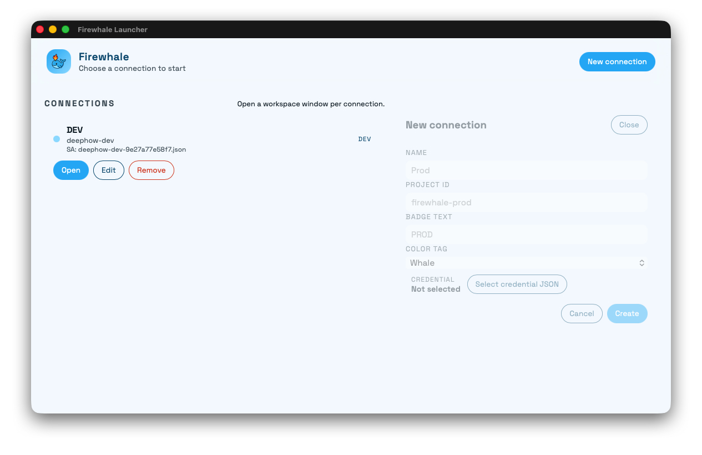
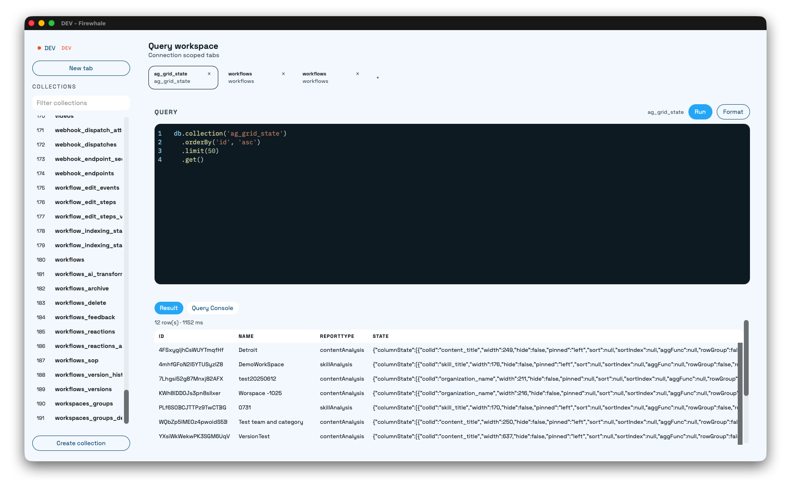
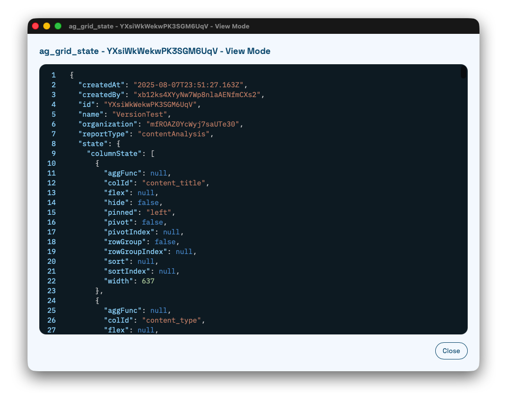

# Firewhale

Firewhale is a desktop workspace for Firebase Firestore. Browse collections, run queries, inspect results, and edit documents in a focused, app-like experience.

## Download

[Release builds](https://github.com/Riddle06/tauri-firewhale/releases)

## Highlights

- Connection-focused workspace with collection navigation.
- Query editor with formatting and a dedicated console.
- Result table with quick JSON view and edit actions.
- Built with Tauri + SvelteKit for a fast native feel.

## Screenshots





## Development

```bash
bun install
bun run dev
```
