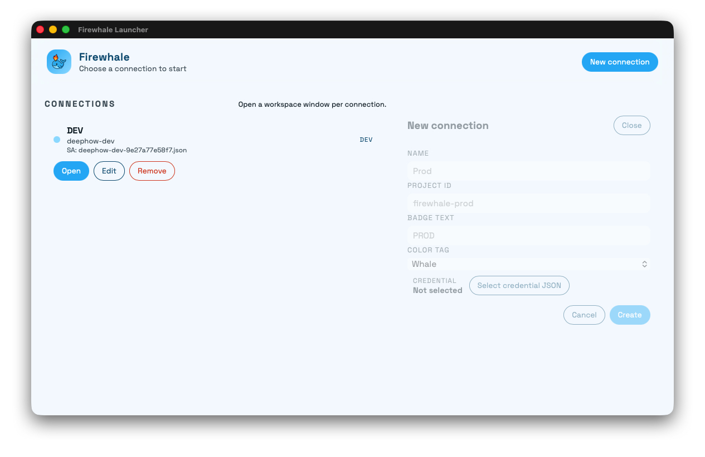
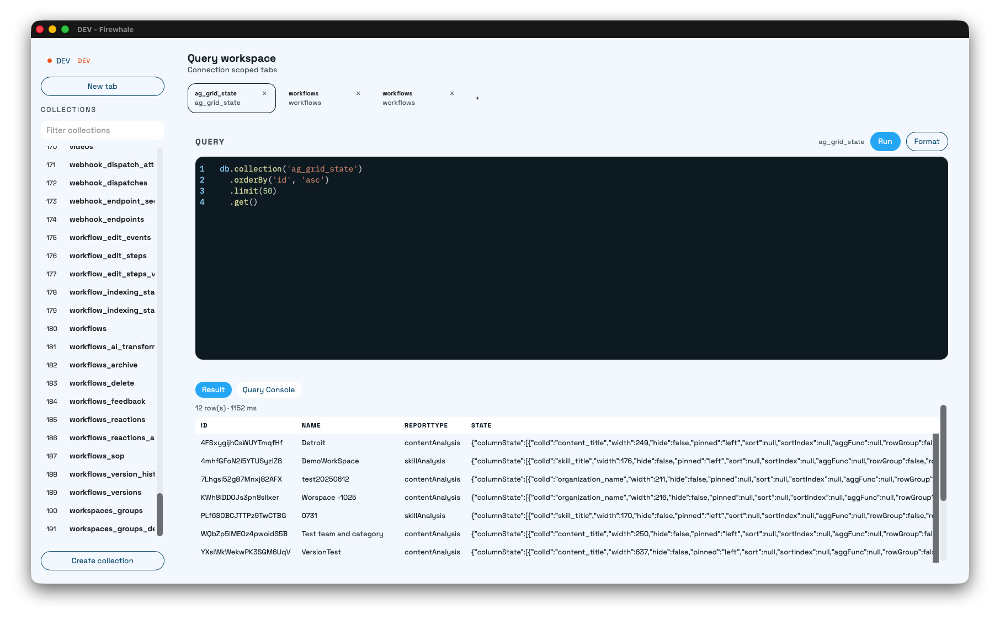
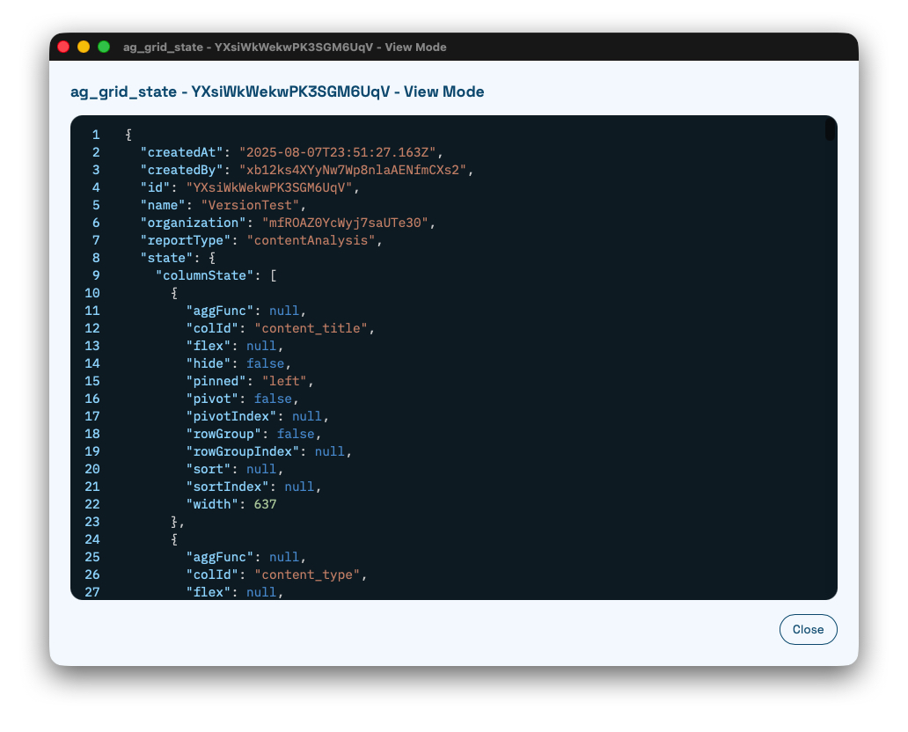

<h1 align="center">Firewhale</h1>

<p align="center">
  
</p>

<p align="center">
  <a href="https://github.com/Riddle06/tauri-firewhale/releases/latest">
    
  </a>
</p>

<p align="center">
  
  
  
  
  <a href="https://github.com/Riddle06/tauri-firewhale/actions/workflows/ci.yml">
    
  </a>
  
</p>

Firewhale is a desktop workspace for Firebase Firestore. Browse collections, run queries, inspect results, and edit documents in a focused, app-like experience.

## Features

- Connection-focused workspace with dedicated windows per project.
- Query editor with autocomplete, formatting, and quick run actions.
- Result table and JSON viewers/editors for fast document inspection.
- Built with Tauri + SvelteKit for a native-feeling desktop workflow.

## Keyboard Shortcuts

| Shortcut | Action |
| --- | --- |
| `Cmd/Ctrl + Enter` | Run active query |
| `Cmd/Ctrl + Shift + F` | Format active query |
| `Shift + Alt + F` | Alternative format shortcut |
| `Tab` | Insert two spaces in query editor |
| `Cmd/Ctrl + W` | Close active query tab in workspace |
| `Cmd/Ctrl + F` | Open search panel in document JSON editor |

## Architecture

```text
SvelteKit SPA (src/routes, src/lib/components)
        |
        v
Tauri v2 shell + multi-window runtime (src-tauri)
        |
        v
Firestore query engine + workspace state (src/lib/query, src/lib/stores)
```

## Tech Stack

| Layer | Stack |
| --- | --- |
| Frontend | SvelteKit 2, Svelte 5, Vite |
| Desktop Runtime | Tauri 2 |
| Language | TypeScript, Rust |
| Editor | CodeMirror 6 |
| Data/Domain | Firebase Firestore APIs |
| Package Manager | Bun |
| CI/CD | GitHub Actions + GitHub Releases |

## Screenshots





## Development

```bash
bun install
bun run dev
bun run tauri dev
```

## Author

- Cheng-Ju Li
- GitHub: [@Riddle06](https://github.com/Riddle06)
